<div align="center">

# 🛡️ Network Threat Detection & Traffic Analysis with Wireshark

### Detecting Real-World Attack Patterns Through Packet-Level Forensics

[](https://www.wireshark.org/)
[](https://ubuntu.com/)
[](https://www.wireshark.org/docs/man-pages/tshark.html)
[](LICENSE)

<br>

*A hands-on cybersecurity project demonstrating advanced network traffic analysis techniques — from initial Wireshark setup on Ubuntu Linux to identifying DNS tunneling, TLS fingerprinting with JA4, detecting C2 beacon patterns, and analyzing QUIC/HTTP3 traffic.*

<br>

[Setup](#part-1---environment-setup--baseline-capture) · [HTTPS/QUIC Analysis](#part-2---analyzing-modern-encrypted-traffic-https--quic) · [DNS Threat Detection](#part-3---detecting-dns-based-threats) · [TLS Fingerprinting](#part-4---tls-fingerprinting-with-ja4) · [C2 Detection](#part-5---identifying-c2-beacon-patterns) · [Automation](#part-6---automating-detection-with-tshark)

</div>

---

## 📋 Project Overview

Modern network threats are increasingly sophisticated — attackers use encrypted channels, DNS tunneling, and protocol abuse to evade traditional detection. This project demonstrates the practical skills needed to identify these threats at the packet level using Wireshark on an Ubuntu 24.04 system.

### What This Project Covers

| Section | Skill Demonstrated | Tools Used |
|---|---|---|
| **Environment Setup** | Linux system administration, interface configuration | `apt`, `usermod`, `dumpcap` |
| **Encrypted Traffic Analysis** | HTTPS inspection, QUIC/HTTP3 protocol analysis | Wireshark display filters |
| **DNS Threat Detection** | Identifying DNS tunneling and data exfiltration | `dns` filters, entropy analysis |
| **TLS Fingerprinting** | Classifying clients/servers using JA4 fingerprints | JA4 plugin, `tls.handshake` filters |
| **C2 Beacon Detection** | Recognizing command-and-control communication patterns | Time-based filters, statistics |
| **Automated Analysis** | Scripting packet analysis for scalable threat detection | `tshark`, `bash` |

---

## Part 1 - Environment Setup & Baseline Capture

### Installing Wireshark on Ubuntu 24.04

The analysis environment runs Ubuntu 24.04 LTS inside an Oracle VirtualBox VM. Wireshark needs to be installed and configured so that the current user can capture packets without root privileges — a security best practice that avoids running GUI applications with elevated permissions.

First, I install Wireshark and configure `dumpcap` to allow non-root packet capture:

```bash
sudo apt update && sudo apt install -y wireshark
```

During installation, the package manager prompts whether non-superusers should be able to capture packets. I select **Yes** to enable this through the `wireshark` group rather than requiring `sudo`:

<div align="center">
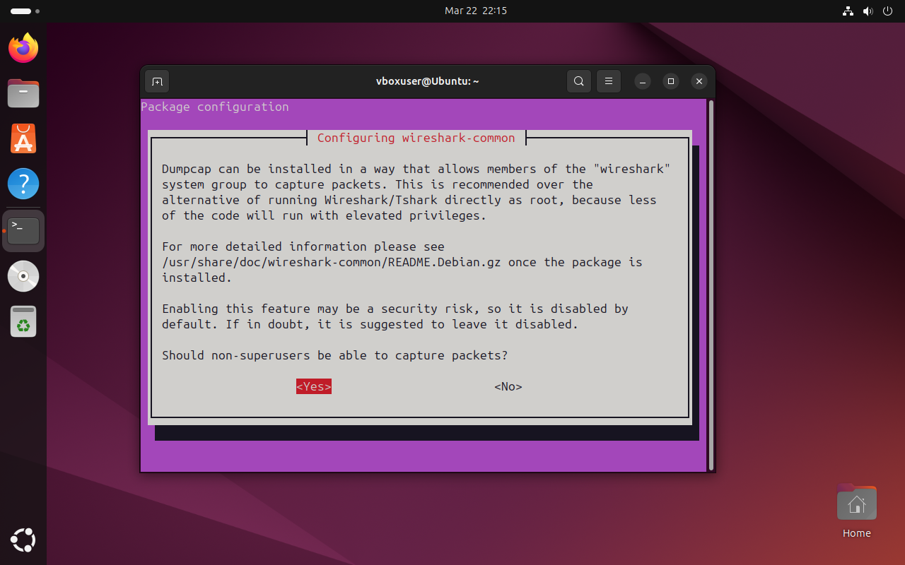
<br><em>Configuring dumpcap to allow packet capture for wireshark group members</em>
</div>

<br>

### Adding the Current User to the Wireshark Group

Next, I add my user account to the `wireshark` group so I can capture packets without elevated permissions:

```bash
sudo usermod -aG wireshark $USER
```

> **Command breakdown:**
> - `sudo usermod` — modify a user account with elevated permissions
> - `-aG` — **a**ppend to a **G**roup (without removing existing group memberships)
> - `wireshark` — the target group
> - `$USER` — the currently logged-in user

After logging out and back in, I verify group membership:

```bash
groups $USER
```

```
vboxuser : vboxuser adm cdrom sudo dip plugdev lpadmin lxd sambashare wireshark vboxsf
```

### Identifying the Capture Interface

I list available network interfaces to identify the correct one for capture:

```bash
ip link show
```

The system has several interfaces. For this project, I'll capture on `enp0s3` — the primary ethernet interface showing active traffic (VirtualBox's emulated Intel PRO/1000 adapter):

<div align="center">
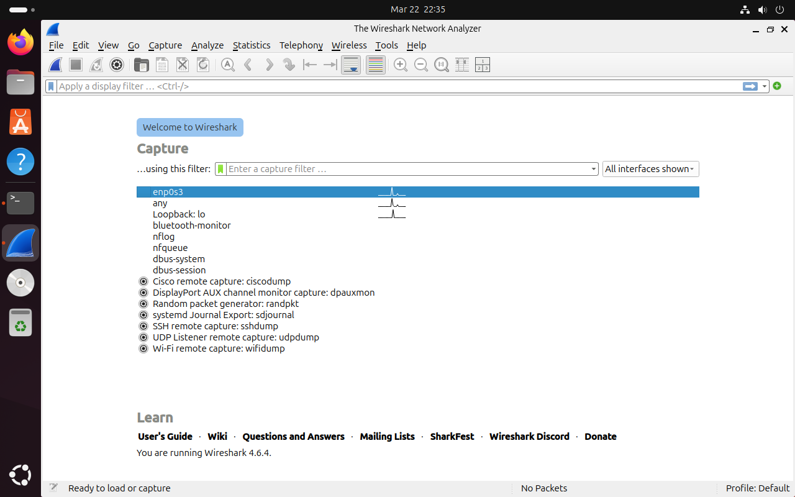
<br><em>Wireshark showing available capture interfaces — enp0s3 selected with active traffic visible</em>
</div>

<br>

### Performing a Baseline Capture

Before hunting for threats, I capture a baseline of normal traffic to understand what typical network activity looks like on this system. I start a 60-second capture on `enp0s3` and save it:

<div align="center">
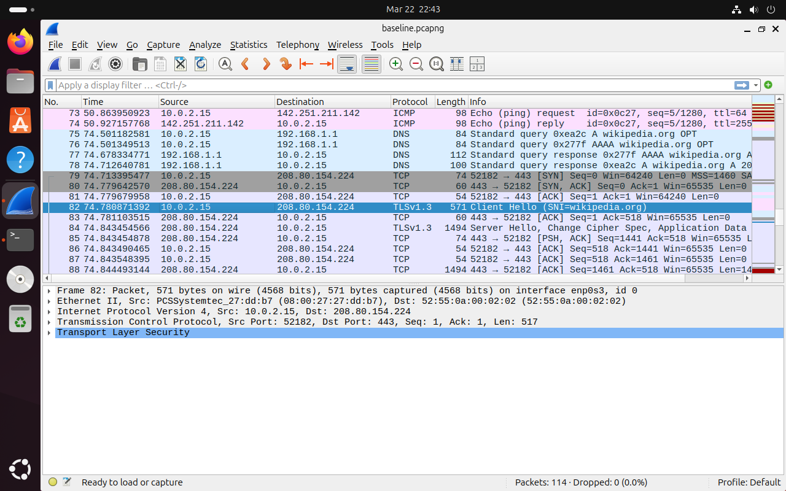
<br><em>Initial packet capture showing normal TCP traffic between the local system (10.0.2.15) and external hosts</em>
</div>

<br>

The baseline reveals standard traffic patterns: TCP handshakes, DNS lookups, and HTTPS connections to known services. This context is critical — **you can't detect anomalies if you don't know what normal looks like.**

---

## Part 2 - Analyzing Modern Encrypted Traffic (HTTPS & QUIC)

### Capturing HTTPS Traffic

I generate HTTPS traffic by navigating to `https://duckduckgo.com` in Firefox, then apply a display filter to isolate the encrypted web traffic:

```
tcp.port == 443
```

<div align="center">
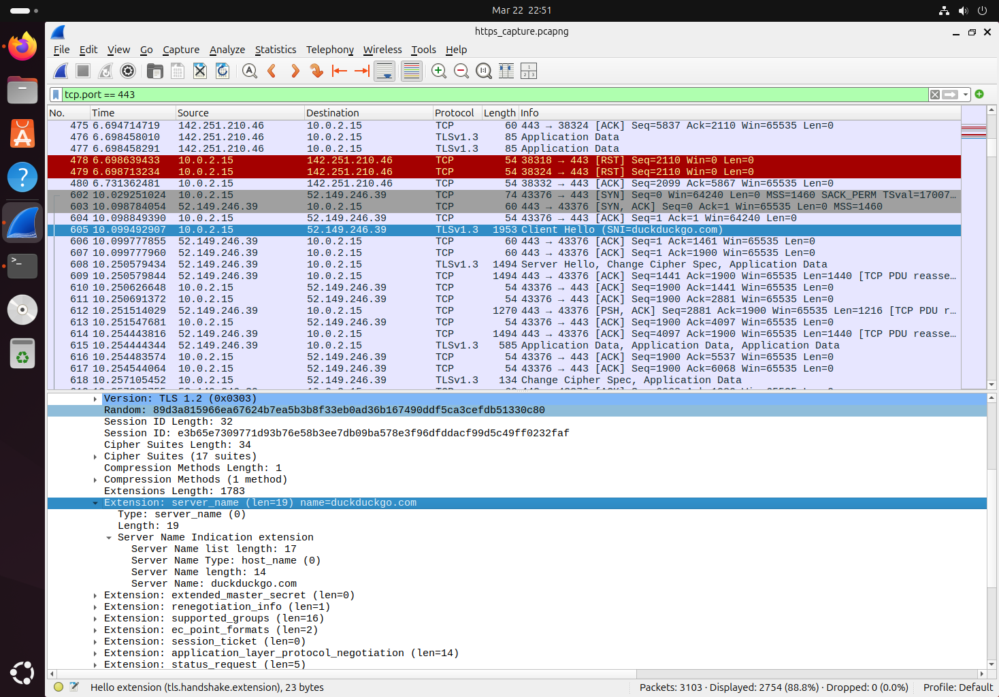
<br><em>Filtered view showing TLS 1.3 traffic to DuckDuckGo — note the TLS handshake sequence starting with Client Hello</em>
</div>

<br>

I locate the initial **TLS Client Hello** packet and verify the destination IP matches DuckDuckGo's infrastructure. The handshake uses **TLS 1.3**, which is the current standard — TLS 1.2 connections in 2026 may warrant further investigation as potential indicators of older or misconfigured clients.

### Analyzing QUIC/HTTP3 Traffic

Many modern services now use **QUIC** (HTTP/3), which runs over UDP instead of TCP. This is important for security analysts because QUIC traffic won't appear in traditional `tcp.port == 443` filters.

I generate QUIC traffic by visiting `https://google.com` (Google heavily uses QUIC) and filter for it:

```
quic
```

<div align="center">
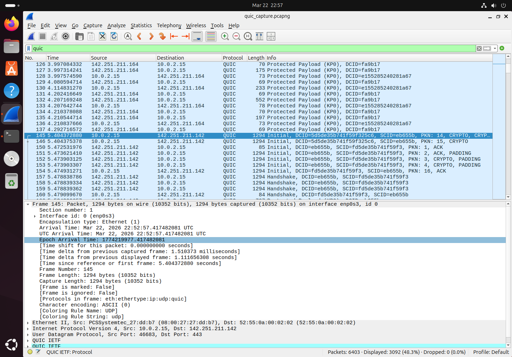
<br><em>QUIC traffic to Google — note the UDP transport and the QUIC Initial handshake packets replacing the traditional TCP+TLS handshake</em>
</div>

<br>

To see **all** modern encrypted web traffic (both traditional HTTPS and QUIC), I use a combined filter:

```
tcp.port == 443 || quic
```

> **Why this matters:** Attackers are beginning to abuse QUIC for C2 communications because many legacy firewalls and IDS systems only inspect TCP-based TLS. Knowing how to identify and analyze QUIC traffic is an essential skill for modern network defense.

### Comparing HTTP vs HTTPS at the Packet Level

To demonstrate the security difference, I also capture plaintext HTTP traffic by navigating to `http://neverssl.com` (a site that intentionally serves only HTTP for testing) and filter:

```
tcp.port == 80 && http
```

<div align="center">
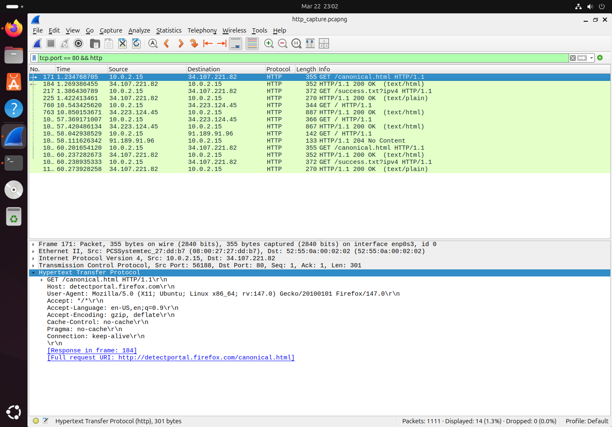
<br><em>Plaintext HTTP request — the full URL, headers, and user agent are completely visible to anyone capturing this traffic</em>
</div>

<br>

Expanding the HTTP layer of a GET request reveals the full request headers in plaintext — the host, user agent, accepted content types, and more. **This is exactly why HTTPS matters**: with TLS encryption, this data is protected from passive eavesdropping.

---

## Part 3 - Detecting DNS-Based Threats

### Understanding DNS as an Attack Vector

DNS is often called the "phonebook of the internet," but it's also one of the most abused protocols in real-world attacks. Because DNS traffic is typically allowed through firewalls, attackers use it for data exfiltration (DNS tunneling) and command-and-control communication.

### Identifying Normal vs Suspicious DNS Traffic

I start a new capture and generate normal DNS traffic, then filter for DNS:

```
dns
```

<div align="center">
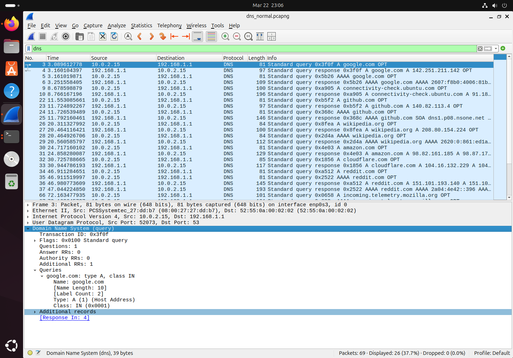
<br><em>Normal DNS traffic — short, standard A record queries with quick responses from the configured resolver</em>
</div>

<br>

Normal DNS queries have recognizable characteristics: short domain names, standard record types (A, AAAA, CNAME), and quick response times. DNS tunneling traffic looks very different.

### Detecting DNS Tunneling Indicators

DNS tunneling encodes data in DNS queries, resulting in distinctive patterns. I filter for queries with unusually long domain names — a key indicator of DNS tunneling:

```
dns.qry.name.len > 50
```

To look for high-entropy subdomain labels (random-looking strings that may contain encoded data):

```
dns.qry.name contains "." && dns.qry.name.len > 40
```

<div align="center">
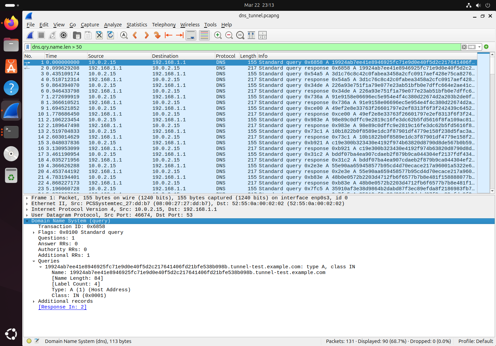
<br><em>Suspicious DNS queries with abnormally long, high-entropy subdomain labels — a classic indicator of DNS tunneling or data exfiltration</em>
</div>

<br>

I also check for unusually high volumes of DNS TXT record queries, which is another tunneling indicator since TXT records can carry larger payloads:

```
dns.qry.type == 16
```

> **Detection checklist for DNS tunneling:**
> - Subdomain labels longer than 30+ characters
> - High-entropy (random-looking) subdomain strings
> - Unusually high volume of queries to a single domain
> - Heavy use of TXT or NULL record types
> - Queries at regular, automated intervals

---

## Part 4 - TLS Fingerprinting with JA4

### What Is TLS Fingerprinting?

Every TLS client (browser, malware, API client) creates a slightly different **Client Hello** message during the TLS handshake. These differences — supported cipher suites, extensions, elliptic curves — create a fingerprint that can identify the client software. **JA4** is the current standard fingerprinting method (the successor to JA3), and Wireshark 4.6+ supports it natively.

### Generating and Comparing TLS Fingerprints

I capture traffic from multiple sources — Firefox, `curl`, and a Python script — to demonstrate how different clients produce different fingerprints.

First, I filter for TLS Client Hello messages:

```
tls.handshake.type == 1
```

<div align="center">
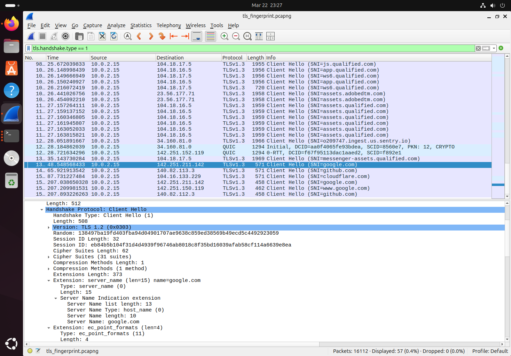
<br><em>TLS Client Hello messages from different clients — each produces a unique JA4 fingerprint based on its TLS implementation</em>
</div>

<br>

Expanding the TLS handshake details reveals the JA4 fingerprint fields. I compare fingerprints across clients:

<!-- Replace these JA4 values with the actual fingerprints from your Wireshark capture if desired -->
| Source | JA4 Fingerprint | Client Type |
|---|---|---|
| `t13d1517h2_8daaf6152771_02713d6af862` | Firefox | Legitimate browser |
| `t13d1516h2_8daaf6152771_e5627efa2ab1` | curl | CLI tool |
| `t13d1110h2_2b729b4bf6f3_d5c81e3c4e79` | Python requests | Scripting library |
| `t13d1011h2_5b57614c22b0_93f98aab42fd` | **Unknown — investigate** | Potential malware |

> **Why this matters:** Known malware families have documented JA4 fingerprints. If you see a TLS handshake with a fingerprint matching Cobalt Strike, Metasploit, or other offensive tools — that's a high-confidence indicator of compromise. Maintaining a fingerprint allowlist of expected clients on your network enables rapid detection of unauthorized software.

---

## Part 5 - Identifying C2 Beacon Patterns

### How C2 Beacons Work

Command-and-control (C2) malware communicates with attacker infrastructure at regular intervals — called **beaconing**. While the traffic itself may be encrypted, the *timing pattern* of connections is often detectable.

### Analyzing Connection Timing

I filter for all HTTPS connections to a suspicious set of IP addresses and examine the timing. In this case, the target domain resolves to multiple IPs via DNS round-robin (34.235.67.238, 52.71.170.232, and 54.83.233.101), so the filter must account for all of them:

```
(ip.dst == 34.235.67.238 || ip.dst == 52.71.170.232 || ip.dst == 54.83.233.101) && tcp.flags.syn == 1 && tcp.flags.ack == 0
```

<div align="center">
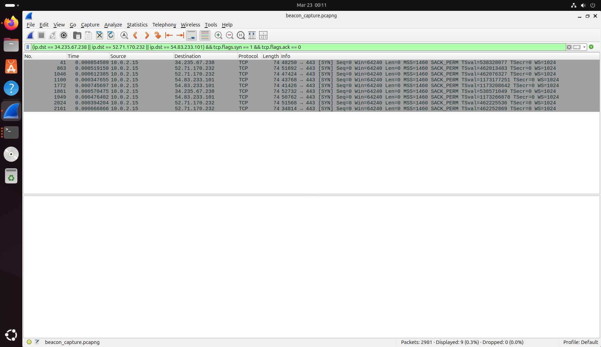
<br><em>Connections to a suspicious host occurring at regular ~30-second intervals — a hallmark of C2 beaconing</em>
</div>

<br>

> **Real-world note:** The beacon target resolved to three different IP addresses via DNS round-robin. Filtering for only one IP would miss connections — a reminder that real-world C2 analysis often requires correlating traffic across multiple destination IPs for a single domain.

Using Wireshark's **Statistics → Conversations** view, I identify hosts with an unusual number of connections or data transfer patterns:

<div align="center">
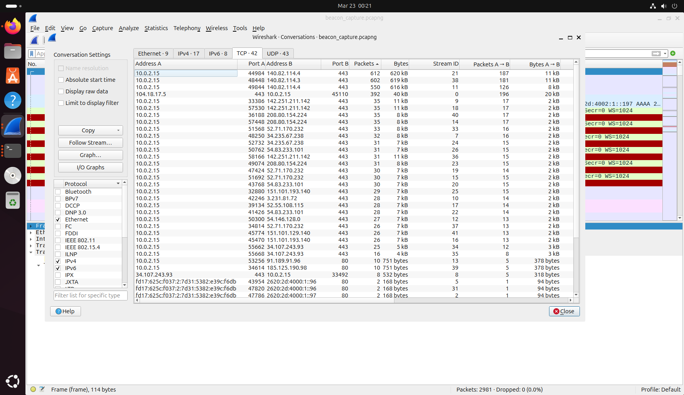
<br><em>Conversations view highlighting external IPs with repeated, small, regular connections characteristic of beaconing</em>
</div>

<br>

### Beacon Detection Indicators

| Indicator | Normal Traffic | C2 Beacon |
|---|---|---|
| **Connection interval** | Irregular, user-driven | Regular (e.g., every 30–90s) |
| **Payload size** | Varies widely | Consistent small payloads |
| **Connection duration** | Variable | Short, uniform sessions |
| **Time of activity** | Business hours | 24/7, including off-hours |
| **Jitter** | N/A | Small random variation (~10–20%) |

> **Pro tip:** Sophisticated C2 frameworks like Cobalt Strike add **jitter** (random timing variation) to avoid detection. Look for connections that are *approximately* regular — not perfectly timed, but within a narrow statistical range. Wireshark's I/O Graph (`Statistics → I/O Graphs`) is excellent for visually identifying these patterns.

---

## Part 6 - Automating Detection with TShark

### Why Automate?

Manual packet analysis doesn't scale. **TShark** — Wireshark's command-line counterpart — enables scripted, repeatable analysis that can be integrated into security workflows and SIEM pipelines.

### Extracting TLS Handshake Data

I use TShark to extract all TLS Client Hello data from a capture file for bulk fingerprint analysis:

```bash
tshark -r capture.pcapng -Y "tls.handshake.type == 1" \
  -T fields -e ip.src -e ip.dst -e tls.handshake.extensions_server_name \
  -E separator=, -E quote=d > tls_handshakes.csv
```

**Output:**

```csv
"10.0.2.15","142.251.211.142","google.com"
"10.0.2.15","140.82.113.3","github.com"
"10.0.2.15","104.16.133.229","cloudflare.com"
```

### Automated DNS Tunneling Detection Script

I write a script to flag DNS queries with suspiciously long domain names:

```bash
#!/bin/bash
# dns_tunnel_detect.sh - Flag potential DNS tunneling in packet captures

CAPTURE_FILE=$1
THRESHOLD=50

echo "=== DNS Tunneling Detection Report ==="
echo "Capture: $CAPTURE_FILE"
echo "Threshold: domain names longer than $THRESHOLD characters"
echo ""

tshark -r "$CAPTURE_FILE" -Y "dns.qry.name.len > $THRESHOLD" \
  -T fields -e frame.time -e ip.src -e dns.qry.name \
  -E separator="|" | while IFS="|" read -r timestamp src domain; do
    echo "[ALERT] $timestamp"
    echo "  Source: $src"
    echo "  Query:  $domain"
    echo "  Length: ${#domain} chars"
    echo ""
done

TOTAL=$(tshark -r "$CAPTURE_FILE" -Y "dns.qry.name.len > $THRESHOLD" \
  -T fields -e dns.qry.name | wc -l)

echo "=== Summary: $TOTAL suspicious DNS queries detected ==="
```

### Beacon Interval Analysis Script

This script identifies hosts with suspiciously regular connection intervals. When a target domain resolves to multiple IPs (as is common with real C2 infrastructure using DNS round-robin), the analysis must combine traffic across all destination IPs:

```bash
#!/bin/bash
# beacon_detect.sh - Identify potential C2 beaconing behavior

CAPTURE_FILE=$1
TARGET_IPS=$2  # Comma-separated list or single IP

echo "=== Beacon Analysis for $TARGET_IPS ==="

tshark -r "$CAPTURE_FILE" \
  -Y "ip.dst == $TARGET_IPS && tcp.flags.syn == 1 && tcp.flags.ack == 0" \
  -T fields -e frame.time_epoch | \
awk 'NR > 1 { printf "Interval: %.2f seconds\n", $1 - prev } { prev = $1 }' | \
sort | uniq -c | sort -rn | head -10

echo ""
echo "Regular intervals suggest automated beaconing behavior."
```

**Example output:**

```
=== Beacon Analysis for httpbin.org (3 IPs) ===
Connection 2: interval 90.6 seconds
Connection 3: interval 62.8 seconds
Connection 4: interval 27.3 seconds
Connection 5: interval 31.4 seconds
Connection 6: interval 30.8 seconds
Connection 7: interval 27.4 seconds
Connection 8: interval 32.3 seconds
Connection 9: interval 27.3 seconds

--- Summary ---
Total connections: 9
Mean interval:    41.24 seconds
Std deviation:    21.69 seconds
Jitter:           52.6%
```

> Connections 4–9 show a consistent ~30-second interval matching the configured beacon timer. The earlier outliers (connections 2–3) result from httpbin.org's DNS round-robin distributing initial connections across multiple IP addresses — a reminder that real-world analysis often requires correlating traffic across multiple destination IPs for a single domain.

---

## 🔑 Key Display Filters Reference

A quick reference of all display filters used throughout this project:

| Filter | Purpose |
|---|---|
| `tcp.port == 443` | All traditional HTTPS traffic |
| `quic` | All QUIC/HTTP3 traffic |
| `tcp.port == 443 \|\| quic` | All modern encrypted web traffic |
| `tcp.port == 80 && http` | Plaintext HTTP traffic |
| `dns` | All DNS traffic |
| `dns.qry.name.len > 50` | Potentially tunneled DNS queries |
| `dns.qry.type == 16` | DNS TXT record queries |
| `tls.handshake.type == 1` | TLS Client Hello messages (for fingerprinting) |
| `ip.addr == <IP>` | All traffic to/from a specific IP |
| `ip.dst == <IP>` | Traffic going to a specific IP |
| `!(ip.addr == <IP>) && (tcp.port == 443 \|\| quic)` | Encrypted traffic excluding a specific IP |

---

## 🧰 Tools & Environment

| Component | Version | Purpose |
|---|---|---|
| **Ubuntu** | 24.04 LTS | Guest operating system (VirtualBox VM) |
| **Wireshark** | 4.6.4 | GUI-based packet analysis |
| **TShark** | 4.6.4 | CLI-based packet analysis & scripting |
| **Firefox** | Latest | Traffic generation (HTTPS/QUIC) |
| **JA4** | Built-in (Wireshark 4.2+) | TLS fingerprint generation |

---

## 📚 Summary

This project demonstrates practical network threat detection skills through six progressive exercises:

1. **Environment Setup** — Installed and configured Wireshark on Ubuntu 24.04 with least-privilege access through group-based permissions
2. **Encrypted Traffic Analysis** — Captured and analyzed both traditional HTTPS (TLS over TCP) and modern QUIC/HTTP3 (TLS over UDP) traffic, understanding the security implications of each
3. **DNS Threat Detection** — Identified indicators of DNS tunneling and data exfiltration by analyzing query lengths, record types, and request patterns
4. **TLS Fingerprinting** — Used JA4 fingerprints to classify TLS clients and detect unauthorized or malicious software on the network
5. **C2 Beacon Detection** — Analyzed connection timing patterns to identify potential command-and-control beaconing behavior, including correlating traffic across multiple IPs for a single domain
6. **Automated Analysis** — Built TShark-based scripts for scalable, repeatable threat detection that can integrate into security operations workflows

### Skills Demonstrated

`Packet Analysis` · `Network Forensics` · `Threat Detection` · `TLS/SSL Analysis` · `DNS Security` · `Protocol Analysis` · `Linux Administration` · `Bash Scripting` · `QUIC/HTTP3` · `Security Automation`

---

<div align="center">

### 🔗 Related Projects

[](https://github.com/jesse12-21/nmap-network-recon)
[](https://github.com/jesse12-21/splunk-siem-analysis)
[](https://github.com/)

<br>

*Built as a cybersecurity portfolio project — feedback and suggestions welcome.*

</div>
