<div align="center">

# 🛡️ Network Threat Detection & Traffic Analysis with Wireshark

### Detecting Real-World Attack Patterns Through Packet-Level Forensics

[](https://www.wireshark.org/)
[](https://ubuntu.com/)
[](https://www.wireshark.org/docs/man-pages/tshark.html)
[](https://attack.mitre.org/)
[](https://github.com/SigmaHQ/sigma)

<br>

*A hands-on cybersecurity project demonstrating end-to-end network threat detection — from packet-level analysis in Wireshark, through Bash automation with TShark, to portable Sigma rules, SOC analyst response playbooks, and a worked investigation report.*

<br>

[Setup](#part-1---environment-setup--baseline-capture) · [HTTPS/QUIC](#part-2---analyzing-modern-encrypted-traffic-https--quic) · [DNS Detection](#part-3---detecting-dns-based-threats) · [JA4 Fingerprinting](#part-4---tls-fingerprinting-with-ja4) · [C2 Detection](#part-5---identifying-c2-beacon-patterns) · [Automation](#part-6---automating-detection-with-tshark) · [Operationalizing](#part-7---operationalizing-the-detections)

</div>

---

## 📋 Project Overview

Modern network threats are increasingly sophisticated — attackers use encrypted channels, DNS tunneling, and protocol abuse to evade traditional detection. This project demonstrates the practical skills needed to identify these threats at the packet level using Wireshark on an Ubuntu 24.04 system, and then operationalizes those detections as portable Sigma rules, SOC playbooks, and a worked investigation example.

### What This Project Covers

| Section | Skill Demonstrated | Tools Used |
|---|---|---|
| **Environment Setup** | Linux system administration, interface configuration | `apt`, `usermod`, `dumpcap` |
| **Encrypted Traffic Analysis** | HTTPS inspection, QUIC/HTTP3 protocol analysis | Wireshark display filters |
| **DNS Threat Detection** | Identifying DNS tunneling and data exfiltration | `dns` filters, entropy analysis |
| **TLS Fingerprinting** | Classifying clients/servers using JA4 fingerprints | JA4 plugin, `tls.handshake` filters |
| **C2 Beacon Detection** | Recognizing command-and-control communication patterns | Time-based filters, statistics |
| **Automated Analysis** | Scripting packet analysis for scalable threat detection | `tshark`, `bash` |
| **Detection Engineering** | Portable detection rules and analyst response procedures | Sigma, MITRE ATT&CK |

### 🎯 Detection Coverage — MITRE ATT&CK Mapping

This project demonstrates detection capabilities for the following adversary techniques, mapped to the [MITRE ATT&CK framework](https://attack.mitre.org/):

| Adversary Technique | ATT&CK ID | Tactic | Detection in This Project |
|---|---|---|---|
| **Application Layer Protocol: Web Protocols** | [T1071.001](https://attack.mitre.org/techniques/T1071/001/) | Command and Control | HTTPS/QUIC traffic baselining (Part 2); beacon timing analysis (Part 5) |
| **Application Layer Protocol: DNS** | [T1071.004](https://attack.mitre.org/techniques/T1071/004/) | Command and Control | Long-name and TXT-record query analysis (Part 3, `dns_tunnel_detect.sh`) |
| **Protocol Tunneling** | [T1572](https://attack.mitre.org/techniques/T1572/) | Command and Control | High-entropy subdomain detection; QUIC abuse identification (Parts 2 & 3) |
| **Exfiltration Over Unencrypted Non-C2 Protocol** | [T1048.003](https://attack.mitre.org/techniques/T1048/003/) | Exfiltration | DNS tunneling ratio analysis with base-domain extraction (`dns_tunnel_detect.sh`) |
| **Encrypted Channel: Asymmetric Cryptography** | [T1573.002](https://attack.mitre.org/techniques/T1573/002/) | Command and Control | JA4 fingerprinting (Part 4); SNI-less handshake detection (`tls_extract.sh`) |
| **Scheduled Transfer** | [T1029](https://attack.mitre.org/techniques/T1029/) | Exfiltration | Jitter-based beacon detection (`beacon_detect.sh`) |
| **Non-Standard Port** | [T1571](https://attack.mitre.org/techniques/T1571/) | Command and Control | Destination port distribution analysis (`beacon_detect.sh`) |

### 📂 Repository Structure

<div align="center">
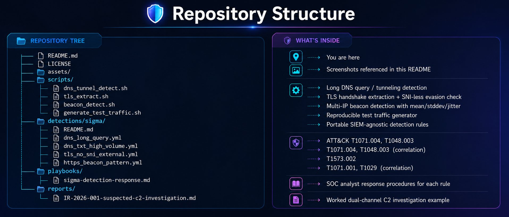
</div>

<br>

<details>
<summary><strong>Text version (click to expand)</strong></summary>

```
.
├── README.md                                          ← You are here
├── LICENSE
├── assets/                                            ← Screenshots referenced in this README
├── scripts/
│   ├── dns_tunnel_detect.sh                           ← Long DNS query / tunneling detection
│   ├── tls_extract.sh                                 ← TLS handshake extraction + SNI-less evasion check
│   ├── beacon_detect.sh                               ← Multi-IP beacon detection with mean/stddev/jitter
│   └── generate_test_traffic.sh                       ← Reproducible test traffic generator
├── detections/sigma/                                  ← Portable SIEM-agnostic detection rules
│   ├── README.md
│   ├── dns_long_query.yml                             ← ATT&CK T1071.004, T1048.003
│   ├── dns_txt_high_volume.yml                        ← T1071.004, T1048.003 (correlation)
│   ├── tls_no_sni_external.yml                        ← T1573.002
│   └── https_beacon_pattern.yml                       ← T1071.001, T1029 (correlation)
├── playbooks/
│   └── sigma-detection-response.md                    ← SOC analyst response procedures for each rule
└── reports/
    └── IR-2026-001-suspected-c2-investigation.md      ← Worked dual-channel C2 investigation example
```

</details>

---

## Part 1 - Environment Setup & Baseline Capture

### Installing Wireshark on Ubuntu 24.04

The analysis environment runs Ubuntu 24.04 LTS inside an Oracle VirtualBox VM. Wireshark needs to be installed and configured so that the current user can capture packets without root privileges — a security best practice that avoids running GUI applications with elevated permissions.

First, I install Wireshark and configure `dumpcap` to allow non-root packet capture:

```bash
sudo apt update && sudo apt install -y wireshark
```

During installation, the package manager prompts whether non-superusers should be able to capture packets. I select **Yes** to enable this through the `wireshark` group rather than requiring `sudo`:

<div align="center">
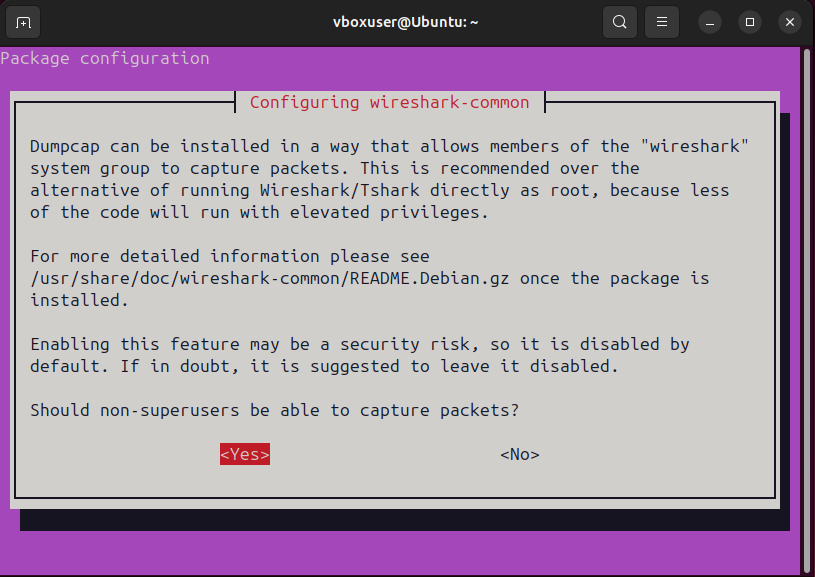
<br><em>Configuring dumpcap to allow packet capture for wireshark group members</em>
</div>

<br>

### Adding the Current User to the Wireshark Group

Next, I add my user account to the `wireshark` group so I can capture packets without elevated permissions:

```bash
sudo usermod -aG wireshark $USER
```

> **Command breakdown:**
> - `sudo usermod` — modify a user account with elevated permissions
> - `-aG` — **a**ppend to a **G**roup (without removing existing group memberships)
> - `wireshark` — the target group
> - `$USER` — the currently logged-in user

After logging out and back in, I verify group membership:

```bash
groups $USER
```

```
vboxuser : vboxuser adm cdrom sudo dip plugdev lpadmin lxd sambashare wireshark vboxsf
```

### Identifying the Capture Interface

I list available network interfaces to identify the correct one for capture:

```bash
ip link show
```

The system has several interfaces. For this project, I'll capture on `enp0s3` — the primary ethernet interface showing active traffic (VirtualBox's emulated Intel PRO/1000 adapter):

<div align="center">
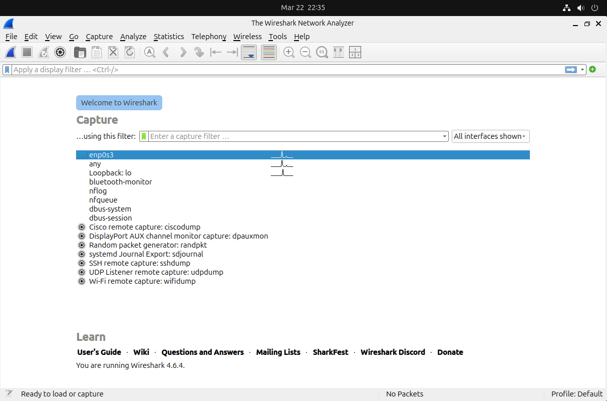
<br><em>Wireshark showing available capture interfaces — enp0s3 selected with active traffic visible</em>
</div>

<br>

### Performing a Baseline Capture

Before hunting for threats, I capture a baseline of normal traffic to understand what typical network activity looks like on this system. I start a 60-second capture on `enp0s3` and save it:

<div align="center">
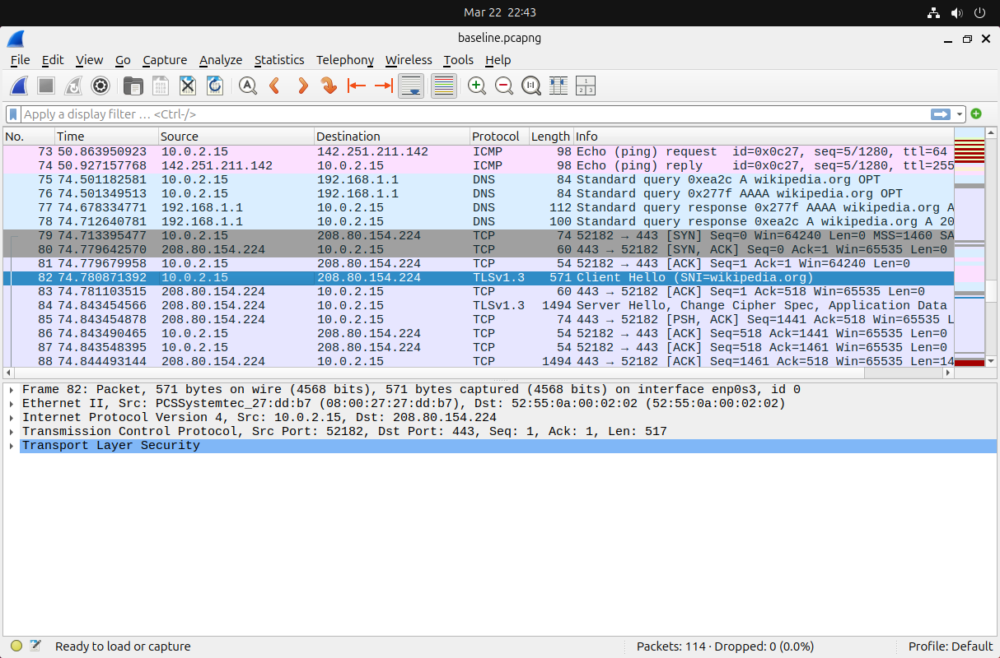
<br><em>Initial packet capture showing normal TCP traffic between the local system (10.0.2.15) and external hosts</em>
</div>

<br>

The baseline reveals standard traffic patterns: TCP handshakes, DNS lookups, and HTTPS connections to known services. This context is critical — **you can't detect anomalies if you don't know what normal looks like.**

---

## Part 2 - Analyzing Modern Encrypted Traffic (HTTPS & QUIC)

### Capturing HTTPS Traffic

I generate HTTPS traffic by navigating to `https://duckduckgo.com` in Firefox, then apply a display filter to isolate the encrypted web traffic:

```
tcp.port == 443
```

<div align="center">
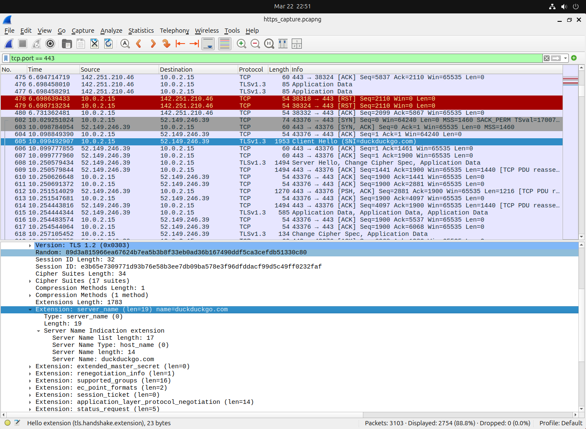
<br><em>Filtered view showing TLS 1.3 traffic to DuckDuckGo — note the TLS handshake sequence starting with Client Hello</em>
</div>

<br>

I locate the initial **TLS Client Hello** packet and verify the destination IP matches DuckDuckGo's infrastructure. The handshake uses **TLS 1.3**, which is the current standard — TLS 1.2 connections in 2026 may warrant further investigation as potential indicators of older or misconfigured clients.

### Analyzing QUIC/HTTP3 Traffic

Many modern services now use **QUIC** (HTTP/3), which runs over UDP instead of TCP. This is important for security analysts because QUIC traffic won't appear in traditional `tcp.port == 443` filters.

I generate QUIC traffic by visiting `https://google.com` (Google heavily uses QUIC) and filter for it:

```
quic
```

<div align="center">
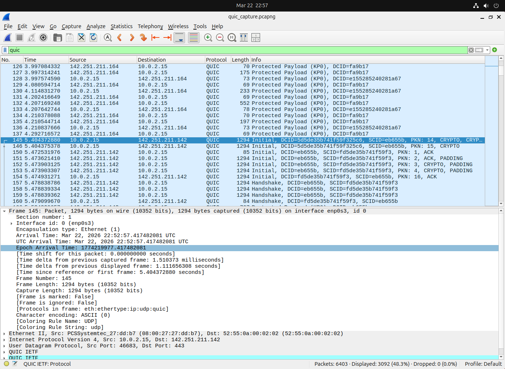
<br><em>QUIC traffic to Google — note the UDP transport and the QUIC Initial handshake packets replacing the traditional TCP+TLS handshake</em>
</div>

<br>

To see **all** modern encrypted web traffic (both traditional HTTPS and QUIC), I use a combined filter:

```
tcp.port == 443 || quic
```

> **Why this matters:** Attackers are beginning to abuse QUIC for C2 communications because many legacy firewalls and IDS systems only inspect TCP-based TLS. Knowing how to identify and analyze QUIC traffic is an essential skill for modern network defense. Encrypted DNS variants — **DNS-over-HTTPS (DoH)** and **DNS-over-QUIC (DoQ)** — are similarly bypassing legacy DNS-based detection, making this part of the toolkit increasingly important.

### Comparing HTTP vs HTTPS at the Packet Level

To demonstrate the security difference, I also capture plaintext HTTP traffic by navigating to `http://neverssl.com` (a site that intentionally serves only HTTP for testing) and filter:

```
tcp.port == 80 && http
```

<div align="center">
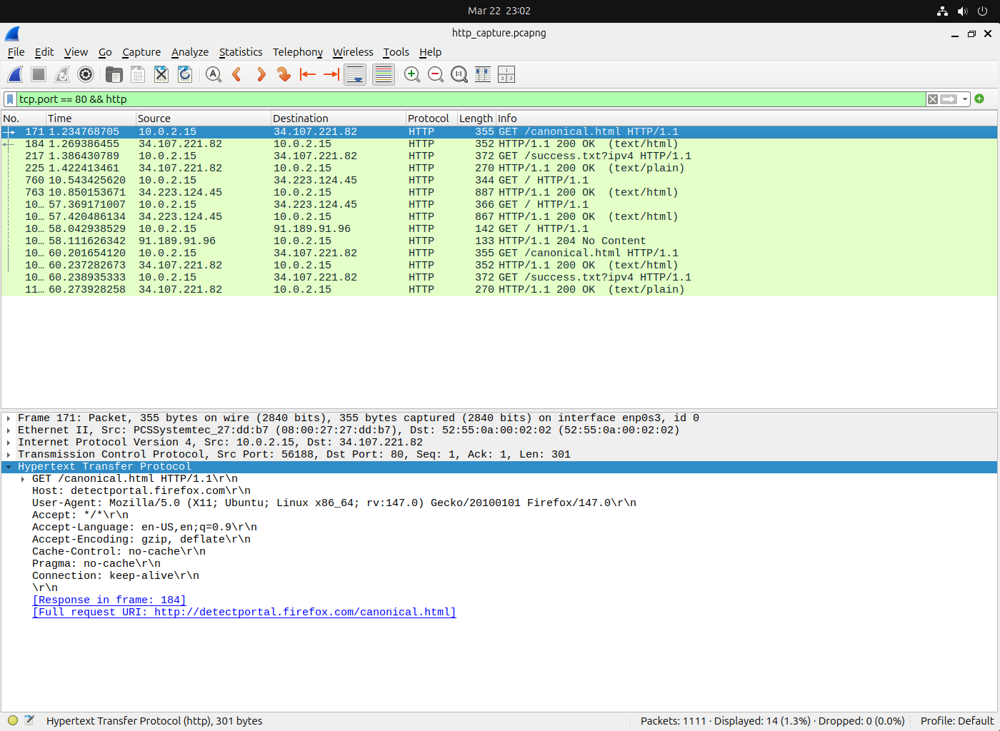
<br><em>Plaintext HTTP request — the full URL, headers, and user agent are completely visible to anyone capturing this traffic</em>
</div>

<br>

Expanding the HTTP layer of a GET request reveals the full request headers in plaintext — the host, user agent, accepted content types, and more. **This is exactly why HTTPS matters**: with TLS encryption, this data is protected from passive eavesdropping.

---

## Part 3 - Detecting DNS-Based Threats

### Understanding DNS as an Attack Vector

DNS is often called the "phonebook of the internet," but it's also one of the most abused protocols in real-world attacks. Because DNS traffic is typically allowed through firewalls, attackers use it for data exfiltration (DNS tunneling) and command-and-control communication.

### Identifying Normal vs Suspicious DNS Traffic

I start a new capture and generate normal DNS traffic, then filter for DNS:

```
dns
```

<div align="center">
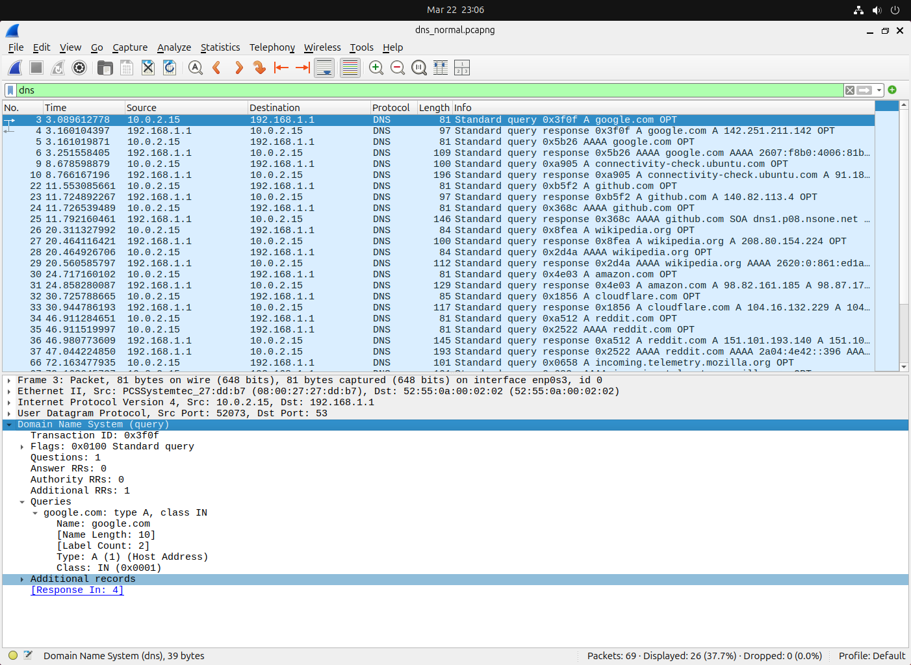
<br><em>Normal DNS traffic — short, standard A record queries with quick responses from the configured resolver</em>
</div>

<br>

Normal DNS queries have recognizable characteristics: short domain names, standard record types (A, AAAA, CNAME), and quick response times. DNS tunneling traffic looks very different.

### Detecting DNS Tunneling Indicators

DNS tunneling encodes data in DNS queries, resulting in distinctive patterns. I filter for queries with unusually long domain names — a key indicator of DNS tunneling:

```
dns.qry.name.len > 50
```

To look for high-entropy subdomain labels (random-looking strings that may contain encoded data):

```
dns.qry.name contains "." && dns.qry.name.len > 40
```

<div align="center">
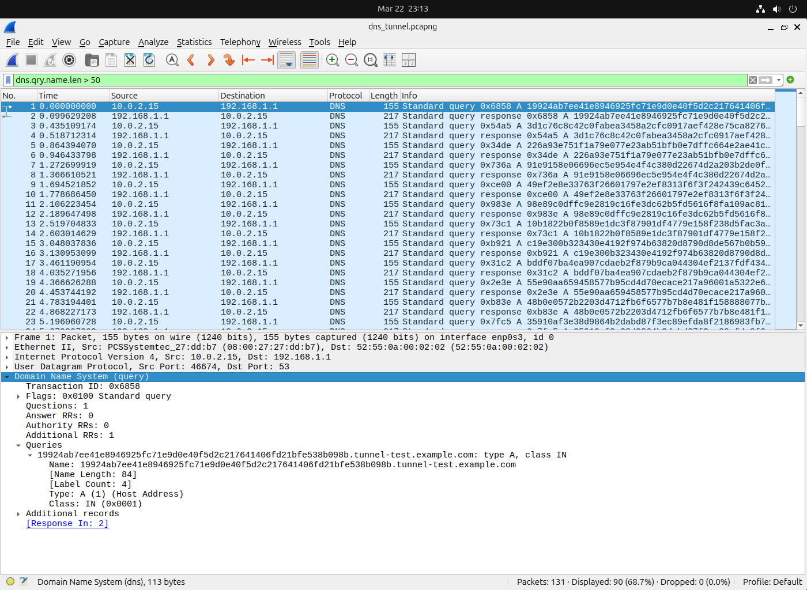
<br><em>Suspicious DNS queries with abnormally long, high-entropy subdomain labels — a classic indicator of DNS tunneling or data exfiltration</em>
</div>

<br>

I also check for unusually high volumes of DNS TXT record queries, which is another tunneling indicator since TXT records can carry larger payloads:

```
dns.qry.type == 16
```

> **Detection checklist for DNS tunneling:**
> - Subdomain labels longer than 30+ characters
> - High-entropy (random-looking) subdomain strings
> - Unusually high volume of queries to a single domain
> - Heavy use of TXT or NULL record types
> - Queries at regular, automated intervals

---

## Part 4 - TLS Fingerprinting with JA4

### What Is TLS Fingerprinting?

Every TLS client (browser, malware, API client) creates a slightly different **Client Hello** message during the TLS handshake. These differences — supported cipher suites, extensions, elliptic curves — create a fingerprint that can identify the client software. **JA4** is the current standard fingerprinting method (the successor to JA3), and Wireshark 4.2+ supports it natively.

### Generating and Comparing TLS Fingerprints

I capture traffic from multiple sources — Firefox, `curl`, and a Python script — to demonstrate how different clients produce different fingerprints.

First, I filter for TLS Client Hello messages:

```
tls.handshake.type == 1
```

<div align="center">
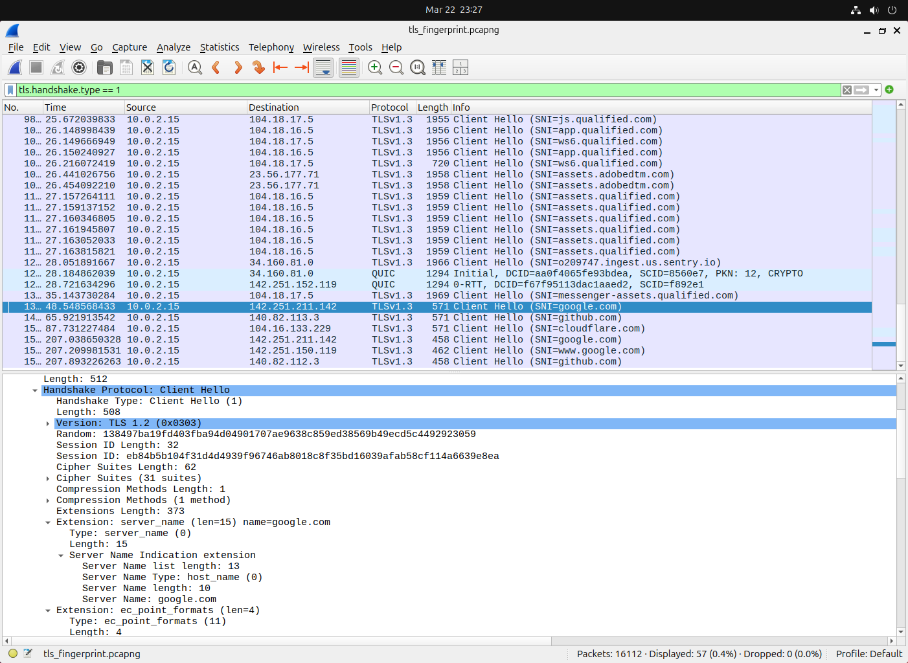
<br><em>TLS Client Hello messages from different clients — each produces a unique JA4 fingerprint based on its TLS implementation</em>
</div>

<br>

Expanding the TLS handshake details reveals the JA4 fingerprint fields. The table below illustrates the typical structure of JA4 fingerprints across different client implementations — note how the prefix (`t13d` = TLS 1.3, DNS-resolved domain) and the cipher/extension hash distinguish each client class:

| JA4 Fingerprint (illustrative) | Client Type | Classification |
|---|---|---|
| `t13d1517h2_8daaf6152771_02713d6af862` | Firefox | Legitimate browser |
| `t13d1516h2_8daaf6152771_e5627efa2ab1` | curl | CLI tool |
| `t13d1110h2_2b729b4bf6f3_d5c81e3c4e79` | Python requests | Scripting library |
| `t13d1011h2_5b57614c22b0_93f98aab42fd` | **Unknown** | Potential malware — investigate |

> **Why this matters:** Known malware families have documented JA4 fingerprints, maintained in databases like the [FoxIO JA4+ database](https://ja4db.com/). If you see a TLS handshake with a fingerprint matching Cobalt Strike, Sliver, Metasploit, or other offensive frameworks — that's a high-confidence indicator of compromise. Maintaining a fingerprint allowlist of expected clients on your network enables rapid detection of unauthorized software.

> **2026 currency note:** Modern Chrome and Cloudflare-fronted services are starting to negotiate **post-quantum hybrid key exchange** (ML-KEM/Kyber, captured as `X25519MLKEM768` in the supported groups extension). JA4 captures this in the cipher/extension hash, so post-quantum-aware clients produce distinct fingerprints from pre-PQ clients — useful both for inventorying PQ rollout and for spotting clients that have *not* upgraded.

---

## Part 5 - Identifying C2 Beacon Patterns

### How C2 Beacons Work

Command-and-control (C2) malware communicates with attacker infrastructure at regular intervals — called **beaconing**. While the traffic itself may be encrypted, the *timing pattern* of connections is often detectable.

### Analyzing Connection Timing

To safely demonstrate this analysis without standing up real attacker infrastructure, I simulate a beacon scenario with a `curl` loop targeting **httpbin.org** — a benign public HTTP testing service used here as a stand-in for the destination IPs. The methodology is identical to investigating real C2; only the target is benign.

The target domain resolves to multiple IPs via DNS round-robin (`34.235.67.238`, `52.71.170.232`, and `54.83.233.101`), so the Wireshark filter must account for all of them — this mirrors real-world C2 infrastructure that distributes beacons across multiple destinations to evade single-IP blocklisting:

```
(ip.dst == 34.235.67.238 || ip.dst == 52.71.170.232 || ip.dst == 54.83.233.101) && tcp.flags.syn == 1 && tcp.flags.ack == 0
```

<div align="center">
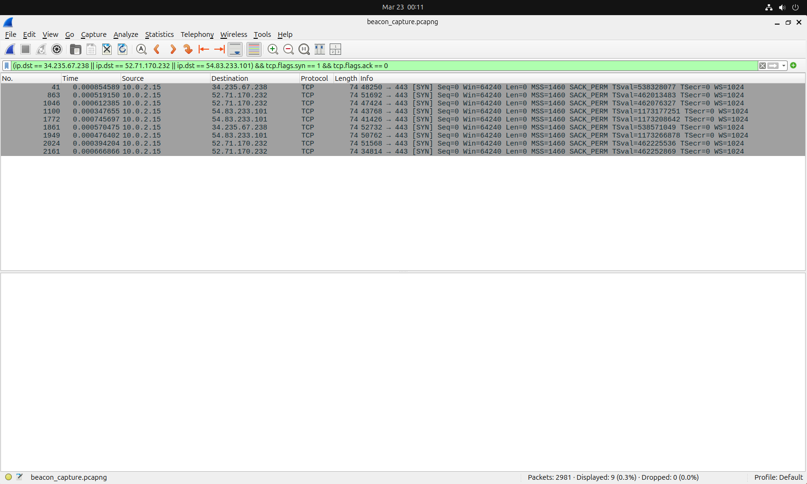
<br><em>Connections to the simulated target occurring at regular ~30-second intervals — the timing pattern characteristic of real C2 beaconing</em>
</div>

<br>

> **Multi-IP correlation in practice:** Filtering for only one IP would miss connections that landed on the other two round-robin destinations. The automation script in Part 6 ([`beacon_detect.sh`](scripts/beacon_detect.sh)) accepts a comma-separated IP list — or a domain name to resolve live — and pools the SYNs across all destinations before computing the timing statistics.

Using Wireshark's **Statistics → Conversations** view, I identify hosts with an unusual number of connections or data transfer patterns:

<div align="center">
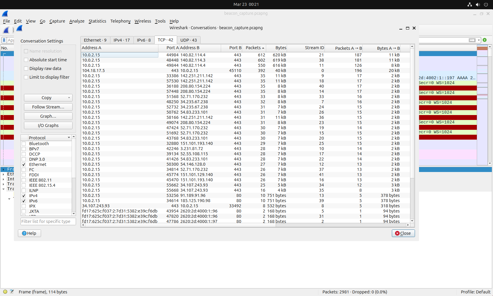
<br><em>Conversations view highlighting external IPs with repeated, small, regular connections characteristic of beaconing</em>
</div>

<br>

### Beacon Detection Indicators

| Indicator | Normal Traffic | C2 Beacon |
|---|---|---|
| **Connection interval** | Irregular, user-driven | Regular (e.g., every 30–90s) |
| **Payload size** | Varies widely | Consistent small payloads |
| **Connection duration** | Variable | Short, uniform sessions |
| **Time of activity** | Business hours | 24/7, including off-hours |
| **Jitter** | N/A | Small random variation (~10–20%) |

> **Pro tip:** Sophisticated C2 frameworks like Cobalt Strike and Sliver add **jitter** (random timing variation) to avoid detection. Look for connections that are *approximately* regular — not perfectly timed, but within a narrow statistical range. Wireshark's I/O Graph (`Statistics → I/O Graphs`) is excellent for visually identifying these patterns; the quantitative version of the same analysis (mean / stddev / jitter percentage) is automated in Part 6.

---

## Part 6 - Automating Detection with TShark

### Why Automate?

Manual packet analysis doesn't scale. **TShark** — Wireshark's command-line counterpart — enables scripted, repeatable analysis that can be integrated into security workflows and SIEM pipelines. The three scripts in [`/scripts/`](scripts/) cover the detection categories from earlier parts of this project, each with input validation, severity tiering, and analyst-ready output.

| Script | Purpose | Key Technique |
|---|---|---|
| [`dns_tunnel_detect.sh`](scripts/dns_tunnel_detect.sh) | Flag DNS queries indicative of tunneling or exfiltration | Length threshold + suspicious-ratio + base-domain grouping |
| [`tls_extract.sh`](scripts/tls_extract.sh) | Inventory TLS Client Hellos and surface evasion indicators | SNI-absence detection |
| [`beacon_detect.sh`](scripts/beacon_detect.sh) | Identify regular-interval connections suggestive of C2 (multi-IP support) | Mean / standard deviation / jitter analysis |

All three scripts use `set -euo pipefail`, validate inputs and tool availability, and produce both human-readable reports and quantitative summaries that can be consumed by downstream tooling.

A companion script, [`generate_test_traffic.sh`](scripts/generate_test_traffic.sh), produces detection-script-detectable patterns safely so anyone cloning this repository can verify the full pipeline end-to-end without shipping pcaps. See [Part 7](#part-7---operationalizing-the-detections) for the end-to-end workflow.

---

### DNS Tunneling Detection — `dns_tunnel_detect.sh`

This script flags DNS queries with abnormally long names — a primary indicator of data being encoded inside subdomain labels for exfiltration. Filtering on `dns.flags.response == 0` ensures only queries are counted (not query/response pairs), which keeps the suspicious-to-total ratio accurate.

**Usage:**

```bash
./scripts/dns_tunnel_detect.sh capture.pcapng 50
```

The second argument is the length threshold (default: 50 characters). Beyond per-query alerts, the script reports total query count, suspicious-to-total ratio, TXT record volume, and groups suspicious queries by their **base domain** (final two labels) so a single tunneling channel doesn't appear as hundreds of unique alerts:

```bash
awk -F'.' '{print $(NF-1)"."$NF}' | sort | uniq -c | sort -rn
```

A severity tier (HIGH / MEDIUM / LOW) is assigned automatically based on the count of suspicious queries detected.

**Example output:**

```
========================================
  DNS Tunneling Detection Report
========================================
Capture:   capture_2026-05-15.pcapng
Threshold: domain names longer than 50 characters

[ALERT] Time: 12.45s into capture
  Source:      10.0.2.15
  Query:       aXjksRnsKfgPqLmNoTyUvWcXdEf.data-relay.exfil-test.lab
  Query Type:  16
  Name Length: 78 chars

[... additional alerts omitted ...]

========================================
  Summary
========================================
  Total DNS queries:        342
  Suspicious (long names):  47
  TXT record queries:       47
  Suspicious ratio:         13.7%

⚠️  HIGH — Significant DNS tunneling indicators detected. Investigate immediately.

Unique suspicious base domains:
     47 exfil-test.lab
```

> **Why this matters:** A high proportion of TXT-record queries with long, high-entropy subdomain labels to a single base domain is a textbook signature of DNS tunneling. Open-source frameworks like `iodine` and `dnscat2` — and commodity exfiltration malware — produce exactly this pattern. Grouping by base domain (rather than full query string) prevents an analyst from being overwhelmed by hundreds of unique alerts that all belong to a single channel.

---

### TLS Handshake Extraction — `tls_extract.sh`

TLS Client Hello messages carry the Server Name Indication (SNI) extension, which reveals the intended destination hostname. Most legitimate clients always send SNI — browsers, system updaters, and well-behaved APIs all rely on it for virtual-hosted infrastructure. **Malware and evasion tools sometimes omit SNI** to make destination identification harder for inspection tooling, especially when connecting directly to a hardcoded C2 IP rather than via a domain.

This script extracts TLS handshake metadata to CSV for downstream analysis and explicitly flags handshakes with no SNI value.

**Usage:**

```bash
./scripts/tls_extract.sh capture.pcapng tls_handshakes.csv
```

**Example output:**

```
========================================
  TLS Handshake Extraction
========================================
Capture:  capture_2026-05-15.pcapng
Output:   tls_handshakes.csv

Extracted 89 TLS Client Hello records.

--- Top Destination Domains (by SNI) ---
     34 www.google.com
     22 duckduckgo.com
     12 github.com
      6 ubuntu.com
      4 mozilla.org

--- Unique Destination IPs ---
142.250.80.46
198.51.100.42
140.82.121.4
[...]

⚠️  Found 11 TLS handshakes without SNI — possible evasion technique.
   These connections may be attempting to hide the destination domain.

   Connections without SNI:
   10.0.2.15,198.51.100.42,443
   10.0.2.15,198.51.100.42,443
   [...]

Full results saved to: tls_handshakes.csv
```

> **Detection insight:** When the same internal host repeatedly opens TLS sessions to the same external IP **without SNI**, two scenarios are most likely: (a) the client is connecting to a raw IP rather than a domain — often a sign of malware with hardcoded C2 infrastructure — or (b) the client is deliberately stripping SNI to evade hostname-based inspection. Either way, it's a high-value pivot for further investigation.

The resulting CSV is also a clean input for downstream JA4 fingerprint correlation (Part 4) or SIEM ingestion.

---

### C2 Beacon Detection — `beacon_detect.sh`

This script analyzes SYN packets to a target — which may be a single IP, a comma-separated list of IPs (for DNS round-robin destinations), or a domain name resolved at runtime — and computes the statistical regularity of connection intervals across all destinations. Real C2 beacons aren't perfectly periodic — modern frameworks like **Cobalt Strike** and **Sliver** add jitter (random timing variation) to defeat simple "every 60 seconds exactly" detection. This script captures that nuance by reporting **mean, standard deviation, and jitter percentage** rather than flagging only fixed intervals.

**Usage:**

```bash
# Single IP
./scripts/beacon_detect.sh capture.pcapng 198.51.100.42

# Multi-IP (DNS round-robin destination)
./scripts/beacon_detect.sh capture.pcapng 198.51.100.42,198.51.100.43,198.51.100.44

# Domain (resolved live)
./scripts/beacon_detect.sh capture.pcapng suspicious.example.com
```

The confidence assessment follows these thresholds:

| Jitter | Connection Count | Confidence |
|---|---|---|
| `< 5%` | `> 10` | **HIGH** — Very regular intervals |
| `< 20%` | `> 5` | **MEDIUM** — Possible jittered beacon |
| Otherwise | — | **LOW** — Likely normal traffic |

**Example output:**

```
========================================
  Multi-IP C2 Beacon Analysis Report
========================================
Capture:    capture_2026-05-15.pcapng
Target spec: 198.51.100.42
Resolved:    1 IP(s)
             - 198.51.100.42

Total SYN packets across all targets: 11
Capture duration for these hosts: 312s

--- Combined Connection Interval Distribution ---
(Count | Interval in seconds)

      4 30
      3 31
      2 29
      1 32

--- Combined Statistical Summary ---
  Mean interval:     30.20 seconds
  Std deviation:     0.98 seconds
  Jitter:            3.2%
  Connection count:  11

⚠️  HIGH CONFIDENCE — Very regular intervals with low jitter.

Recommended next steps:
  1. Confirm JA4 fingerprints match across all destination IPs
  2. Investigate IP reputation for each destination (VirusTotal, AbuseIPDB)
  3. Check passive DNS history — do these IPs share a common domain?
  4. Review payload sizes for consistency across destinations
  5. Check whether activity continues outside business hours
```

> **Real-world note:** Uses tshark's `ip.dst in {ip1 ip2 ip3}` set syntax to pool SYNs across all destinations before computing intervals — which is the correct approach for round-robin or fast-flux infrastructure. When a domain is passed instead of an IP list, the script resolves it live; note that current DNS resolution may differ from what was in the capture, so passing observed IPs is preferable for historical investigations.

---

### Putting It Together — A Three-Script Investigation Chain

The scripts are designed to **compose**: an alert from one tool naturally pivots into the next. A typical investigation chain looks like:

1. **`dns_tunnel_detect.sh`** flags an internal host issuing long, high-entropy DNS queries to a previously-unseen base domain → identify the source IP
2. **`tls_extract.sh`** on the same capture, filtered to that source host, identifies all TLS destinations → look for SNI-less or otherwise anomalous connections
3. **`beacon_detect.sh`** against any suspicious destination IP confirms or rules out periodic beaconing behavior

A full worked example of this chain — using realistic outputs from all three scripts to investigate a simulated dual-channel C2 compromise — is available in [`reports/IR-2026-001-suspected-c2-investigation.md`](reports/IR-2026-001-suspected-c2-investigation.md).

---

## Part 7 - Operationalizing the Detections

Production network defense doesn't stop at finding the bad traffic — it requires portable detection rules, repeatable analyst procedures, and worked examples of the full investigation lifecycle. The companion directories in this repository contain the operational artifacts that bridge the gap between "I can spot it in Wireshark" and "I can run this in a SOC."

### Detection Rules — `/detections/sigma/`

The four detection patterns demonstrated in Parts 3–5 are codified as portable [Sigma](https://github.com/SigmaHQ/sigma) rules. Sigma rules are converted to backend-specific query languages (Splunk SPL, Elasticsearch, Microsoft Sentinel KQL) via `sigma-cli`, making the same detection logic deployable across SIEM stacks.

| Rule File | Detection | MITRE ATT&CK |
|---|---|---|
| [`dns_long_query.yml`](detections/sigma/dns_long_query.yml) | DNS queries with abnormally long names | T1071.004, T1048.003 |
| [`dns_txt_high_volume.yml`](detections/sigma/dns_txt_high_volume.yml) | Sustained TXT-query volume from a single source (correlation rule) | T1071.004, T1048.003 |
| [`tls_no_sni_external.yml`](detections/sigma/tls_no_sni_external.yml) | TLS handshakes to external IPs without SNI | T1573.002 |
| [`https_beacon_pattern.yml`](detections/sigma/https_beacon_pattern.yml) | Repeated HTTPS connections to single destination (correlation rule) | T1071.001, T1029 |

All rules target Zeek log schemas. See the [folder README](detections/sigma/README.md) for SIEM conversion examples and tuning guidance.

### Response Playbook — `/playbooks/`

Detection alone isn't sufficient — analysts need standardized response procedures. The [`sigma-detection-response.md`](playbooks/sigma-detection-response.md) playbook provides phased response procedures for each Sigma rule, covering:

- Initial triage with explicit false-positive cheat sheets
- Investigation steps with specific commands (Splunk SPL, VirusTotal / AbuseIPDB API calls, pivots to the project's PCAP scripts)
- Decision trees mapping verdicts to next actions
- Containment and response procedures, with explicit Tier 2 / IR escalation flags
- Cross-cutting guidance for when multiple rules fire together (e.g., DNS tunneling co-occurring with HTTPS beaconing)

### Worked Investigation — `/reports/`

The [`IR-2026-001`](reports/IR-2026-001-suspected-c2-investigation.md) report walks through a full investigation that uses all three detection scripts in sequence to confirm a simulated dual-channel C2 compromise. It demonstrates:

- Pivoting from one detection (DNS) to another (TLS) to a third (timing)
- Quantitative confidence assessment based on jitter calculation
- ATT&CK technique mapping for the observed activity
- Recommended containment and response actions
- Honest gap analysis of what the detections miss (DoH, multi-IP fast-flux)

### Reproducible Test Traffic — `scripts/generate_test_traffic.sh`

To enable anyone cloning this repository to verify the detection scripts end-to-end without shipping pcaps, [`generate_test_traffic.sh`](scripts/generate_test_traffic.sh) produces detection-script-detectable patterns safely:

- **DNS tunneling pattern** — long TXT queries to RFC 2606 `.invalid` (always NXDOMAIN, no real exfiltration)
- **SNI-less TLS handshakes** — via `openssl s_client` without `-servername` against `example.com`
- **HTTPS beacon pattern** — periodic requests with small jitter
- **Baseline traffic** — normal browsing patterns for contrast

Run alongside `tcpdump` or Wireshark to produce a reproducible PCAP, then feed that PCAP to the detection scripts. Full usage in the script header.

```bash
# In one terminal:
sudo tcpdump -i any -w test_traffic.pcapng

# In another:
./scripts/generate_test_traffic.sh all

# After stopping the capture:
./scripts/dns_tunnel_detect.sh test_traffic.pcapng 50
./scripts/tls_extract.sh test_traffic.pcapng tls.csv
./scripts/beacon_detect.sh test_traffic.pcapng example.com
```

---

## 🔑 Key Display Filters Reference

A quick reference of all display filters used throughout this project:

| Filter | Purpose |
|---|---|
| `tcp.port == 443` | All traditional HTTPS traffic |
| `quic` | All QUIC/HTTP3 traffic |
| `tcp.port == 443 \|\| quic` | All modern encrypted web traffic |
| `tcp.port == 80 && http` | Plaintext HTTP traffic |
| `dns` | All DNS traffic |
| `dns.qry.name.len > 50` | Potentially tunneled DNS queries |
| `dns.qry.type == 16` | DNS TXT record queries |
| `dns.flags.response == 0` | DNS queries only (excludes responses) |
| `tls.handshake.type == 1` | TLS Client Hello messages (for fingerprinting) |
| `tls.handshake.type == 1 && !tls.handshake.extensions_server_name` | TLS Client Hellos missing SNI (evasion indicator) |
| `ip.addr == <IP>` | All traffic to/from a specific IP |
| `ip.dst == <IP>` | Traffic going to a specific IP |
| `ip.dst in {<IP1> <IP2> <IP3>}` | Traffic to any IP in a set (for round-robin destinations) |
| `!(ip.addr == <IP>) && (tcp.port == 443 \|\| quic)` | Encrypted traffic excluding a specific IP |

---

## 🧰 Tools & Environment

| Component | Version | Purpose |
|---|---|---|
| **Ubuntu** | 24.04 LTS | Guest operating system (VirtualBox VM) |
| **Wireshark** | 4.6.4 | GUI-based packet analysis |
| **TShark** | 4.6.4 | CLI-based packet analysis & scripting |
| **Firefox** | Latest | Traffic generation (HTTPS/QUIC) |
| **JA4** | Built-in (Wireshark 4.2+) | TLS fingerprint generation |
| **Sigma** | 2.0 | Portable detection rule format |
| **Bash** | 5.2+ | Detection script runtime |

---

## 📚 Summary

This project demonstrates practical, end-to-end network threat detection through seven progressive parts:

1. **Environment Setup** — Installed and configured Wireshark on Ubuntu 24.04 with least-privilege access through group-based permissions
2. **Encrypted Traffic Analysis** — Captured and analyzed both traditional HTTPS (TLS over TCP) and modern QUIC/HTTP3 (TLS over UDP) traffic, understanding the security implications of each
3. **DNS Threat Detection** — Identified indicators of DNS tunneling and data exfiltration by analyzing query lengths, record types, and request patterns
4. **TLS Fingerprinting** — Used JA4 fingerprints to classify TLS clients and detect unauthorized or malicious software on the network
5. **C2 Beacon Detection** — Analyzed connection timing patterns to identify potential command-and-control beaconing behavior, including correlating traffic across multiple IPs for a single domain
6. **Automated Analysis** — Built three TShark-based detection scripts (DNS tunneling, TLS extraction with SNI-less evasion detection, multi-IP jitter-based beacon analysis) with input validation, severity tiering, and analyst-ready output
7. **Operationalizing the Detections** — Codified detections as portable Sigma rules, authored a SOC response playbook covering all four detections, and documented a worked dual-channel C2 investigation using the full toolkit end-to-end

### Skills Demonstrated

`Packet Analysis` · `Network Forensics` · `Threat Detection` · `TLS/SSL Analysis` · `DNS Security` · `Protocol Analysis` · `MITRE ATT&CK` · `Detection Engineering` · `Sigma Rules` · `SOC Playbooks` · `Incident Response` · `Linux Administration` · `Bash Scripting` · `QUIC/HTTP3` · `Security Automation`

---

<div align="center">

### 🔗 Related Projects

[](https://github.com/jesse12-21/nmap-network-recon)
[](https://github.com/jesse12-21/splunk-siem-analysis)
[](https://github.com/jesse12-21/suricata-ids-rules)
[](https://github.com/jesse12-21/threat-intel-enricher)
[](https://github.com/jesse12-21/aws-cloud-security-lab)

<br>

*Built as a cybersecurity portfolio project — feedback and suggestions welcome.*

</div>
